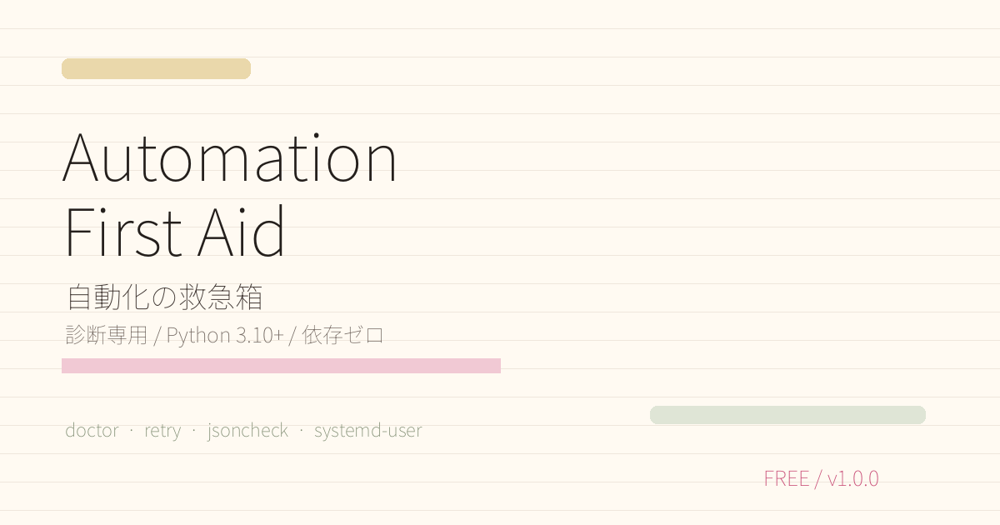

# Automation First Aid 🧰



無料配布: BOOTH / GitHub Release / あませのサイト
- BOOTH: https://amase-memo.booth.pm/items/8778419
- Release: https://github.com/paper-daemon/automation-first-aid/releases/tag/v1.0.0
- Site: https://paper-daemon.github.io/


自動化がコケた時に、最初の10分でやる切り分けを1本にまとめた無料CLIです。Python 3.10+、外部依存なし。

## できること
- `doctor`: Python / 書き込み権限 / 空き容量 / DNS / URL / systemd user manager を確認
- `retry`: エラー文を「再試行」「止めて修正」「要確認」に分類
- `jsoncheck`: JSON / JSONL の壊れた行・列を表示
- `systemd-user`: Linux の `systemd --user` と任意unitを確認

## 使い方
```bash
python3 automation_first_aid.py doctor
python3 automation_first_aid.py doctor --network --url https://example.com
python3 automation_first_aid.py retry --text "connection reset by peer" --exit-code 1
python3 automation_first_aid.py jsoncheck logs.jsonl
python3 automation_first_aid.py systemd-user --unit my-worker.service
```

JSONで機械処理したい時は先頭に `--json` を付けます。

```bash
python3 automation_first_aid.py --json doctor
```

## 方針
診断専用です。設定変更、サービス再起動、ファイル修復は自動実行しません。まず壊れている場所を見つけるための救急箱です。

## License
MIT
